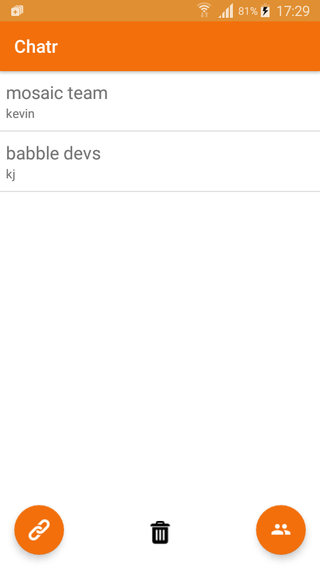
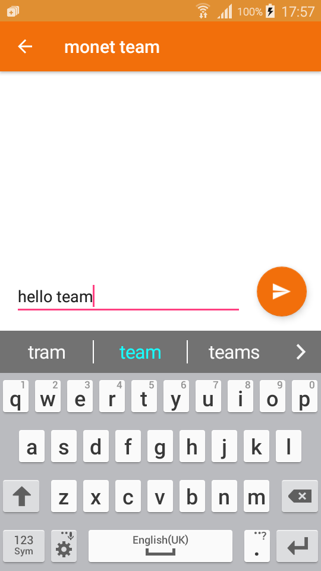

# CHATR: Serverless Chat

Chatr is a demo app which uses the Babble Mobile library to enable
multiple mobile devices to chat without a centralised server.

Stay tuned to find out more about the Babble Mobile library and how
you can use it to build your own apps powered by Babble.

## Peer discovery

When setting up new groups Chatr uses QR codes to share peer
information. This is a multi step process...

---

#### 1. Homescreen

From here you can tap the group names to show conversations or tap to
create or join a new group. Create a new group by tapping the new 
group button on the right...

 
 
 
 
 
 
 
 
 
 
 
 
 

---

#### 2. Create a new group

Choose a name and username for your group. Then start adding members
to the group by tapping the plus button...

 
 
 
 
 
 
 
 
 
 
 
 
 

---

#### 3. Add members

Add a member to your group by scanning their barcode...

 
 
 
 
 
 
 
 
 
 
 
 
 

---

#### 4. Join a group

In the meantime people wanting to join the group have tapped the join
group button on their home screens. They then enter a username and tap
the tick button...

 
 
 
 
 
 
 
 
 
 
 
 
 

---

#### 5. Share their details

They now have a QR code containing their IP address, public key and
username...

 
 
 
 
 
 
 
 
 
 
 
 
 

---

#### 6. Scan the code

Scan the code to add them to the group...

 
 
 
 
 
 
 
 
 
 
 
 
 

---

#### 7. Add all your friends

Scan the codes of all the people you want to join the group. When
you're done tap the tick button...

 
 
 
 
 
 
 
 
 
 
 
 
 

---

#### 8. Share the group details

You now have a QR code with a list of everyone in the group, which you
can share with the group...

 
 
 
 
 
 
 
 
 
 
 
 
 

---

### 9. Scan the Code

In the meantime the other members have tapped the tick button and are
ready to scan your barcode...

 
 
 
 
 
 
 
 
 
 
 
 
 

---

### 10. Almost done

Once they've scanned you're barcode they drop straight into the 
conversation...

 
 
 
 
 
 
 
 
 
 
 
 
 

---

### 11. Start chatring

Once everyone has scanned your code, you're ready to join them by
tapping the tick button...

 
 
 
 
 
 
 
 
 
 
 
 
 